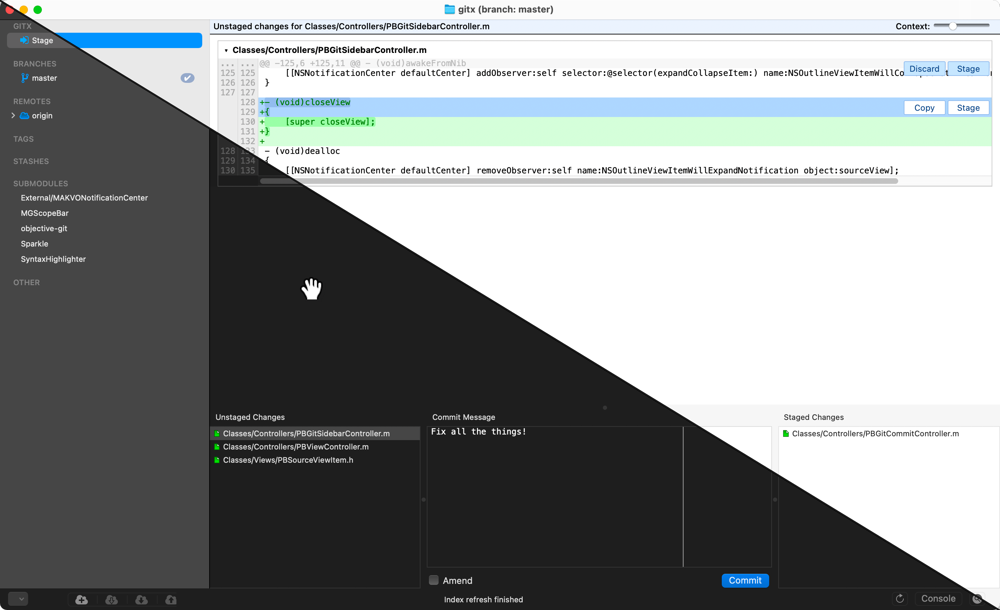
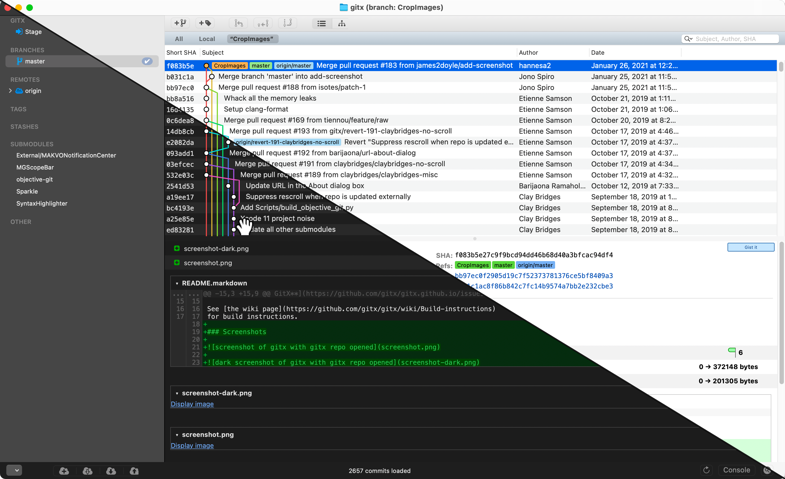

# What is GitX?

[](https://github.com/gitx/gitx/actions/workflows/BuildPR.yml)

GitX is an OS X (MacOS) native graphical client for the `git` version
control system.

GitX has a long history of various branches and versions maintained by
various people over the years. This github org & repo are an attempt to
consolidate and move forward with a current, common, community-maintained
version.

### How to Install:

Install it with [Homebrew](https://brew.sh):

```
brew install --cask gitx
```

This picks the build for your Mac, puts the `gitx` command-line tool on your
PATH, and lets `brew upgrade` keep it up to date.

Or get the latest release of GitX from the [Releases](https://github.com/gitx/gitx/releases)
page. Download, extract and move it to your Applications folder.
For Apple Silicon (M1, M2 processors) please use the `arm64` release.

See also: [How to Build in Xcode](#how-to-build-in-xcode)

### Screenshots





### How to Build in Xcode:

In a fresh clone, run `make bootstrap` before the first build, in Xcode or on
the command line - \
it checks out the submodules and builds the `objective-git`
and `libgit2` dependencies the app links against. If it stops partway, on a
dropped connection for instance, run it again.

You can also build and run on the command line. The `Makefile` wraps the
commands CI uses: `make build`, `make unit-test` and `make dmg` are the common
ones, `make help` lists them all, and `ARCH=x86_64` selects an x86 build.

From a fresh clone, `make bootstrap run` builds the app and opens it.

#### Signing (optional)

Debug builds, from Xcode or `make run`, are signed ad-hoc and need no setup.
Signing with your own certificate is only needed for a build with the hardened
runtime on, and for `make dmg-signed`. It takes a `Dev.xcconfig` file at the
project root, which git ignores.

If you don't have a development certificate yet:

1. Open the **Xcode** app.
2. In Settings > Accounts, if you haven't added your Apple ID yet, click the `+` button and add your Apple ID.
3. In your Apple ID account settings, there should be at least one team with your name and **(Personal Team)** in the name. Click on it.
4. Click on the **Manage Certificates** button.
5. If you don't see any certificate listed, click the `+` button and click on **Apple Development**.
6. Click Done and close the Settings window.

Then `make Dev.xcconfig` writes the file, reading your team ID and certificate
name off the certificate itself, or says what is missing if it cannot. It never
overwrites a file that is already there: after renewing the certificate, run
`FORCE=1 scripts/make-dev-xcconfig.sh`.
If your keychain holds certificates for more than one team, pick one with
`TEAM=YOUR_TEAM_ID make Dev.xcconfig`.

### Apple Silicon

This project is supported by MacStadium Open Source Developer Program with a free Mac mini for our CI. Thank you !


### License

GitX is licensed under the GPL version 2. For more information, see the attached COPYING file.
